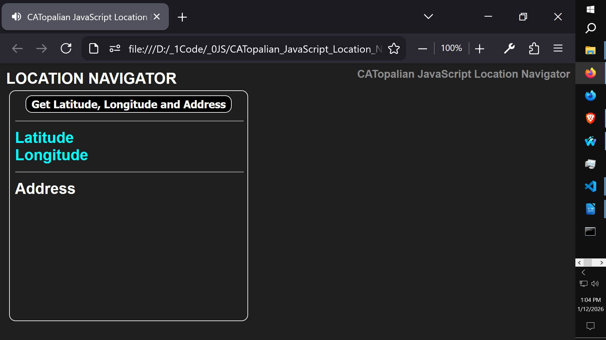
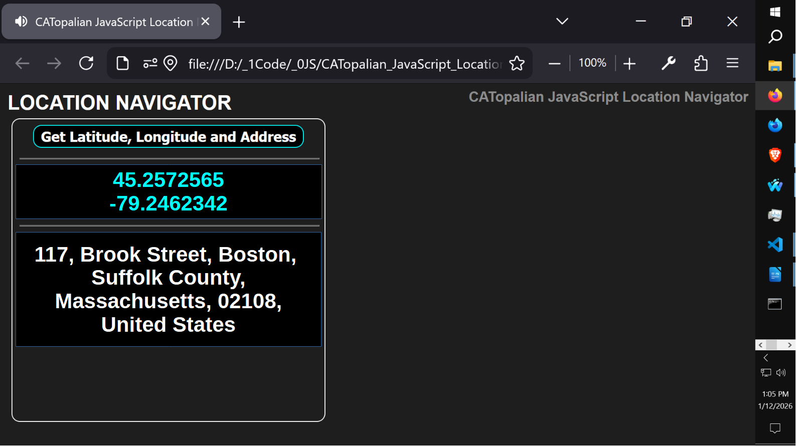

# CATopalian JavaScript Location Navigator

JavaScript app that gets location coordinates of latitude and longitude and converts them to a physical address. This app works on windows, linux, mac, android and ios.

  

  

---

Use App: https://christopherandrewtopalian.github.io/CATopalian_JavaScript_Location_Navigator/CATopalian_JavaScript_Location_Navigator.html

---

How to Download this Engine
1. Click the green Code Button on this github page
2. Choose Download ZIP
3. Save the Zip File
4. Extract All
5. Double click the html file to start the app

//----//

// Dedicated to God the Father  
// All Rights Reserved Christopher Andrew Topalian Copyright 2000-2026  
// https://github.com/ChristopherTopalian  
// https://github.com/ChristopherAndrewTopalian  
// https://sites.google.com/view/CollegeOfScripting  

